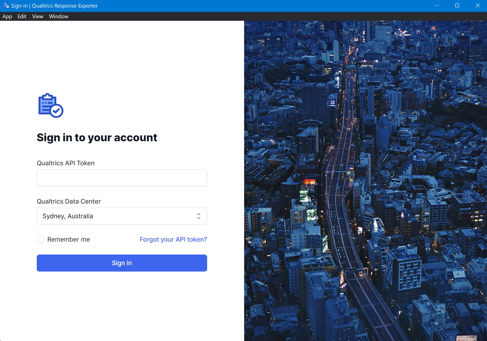
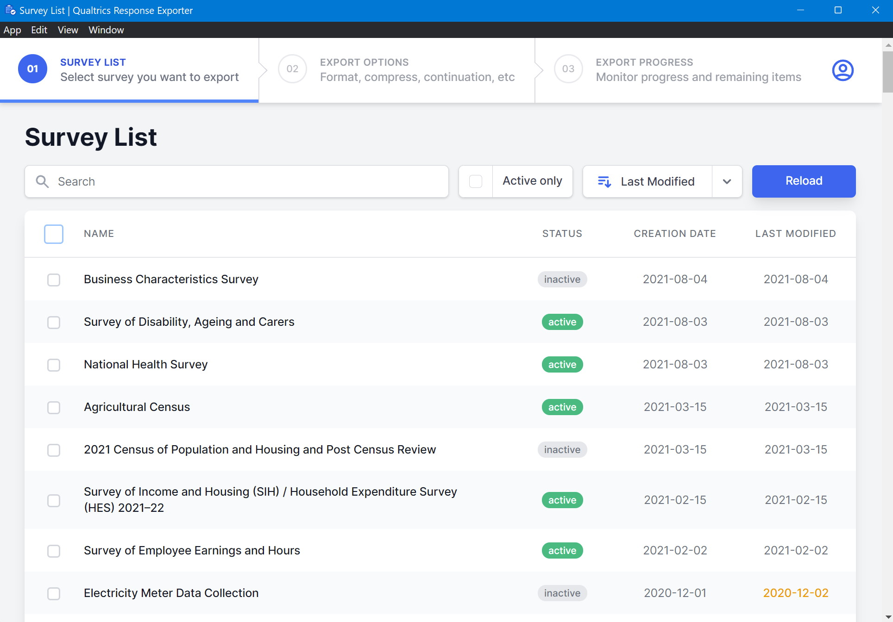
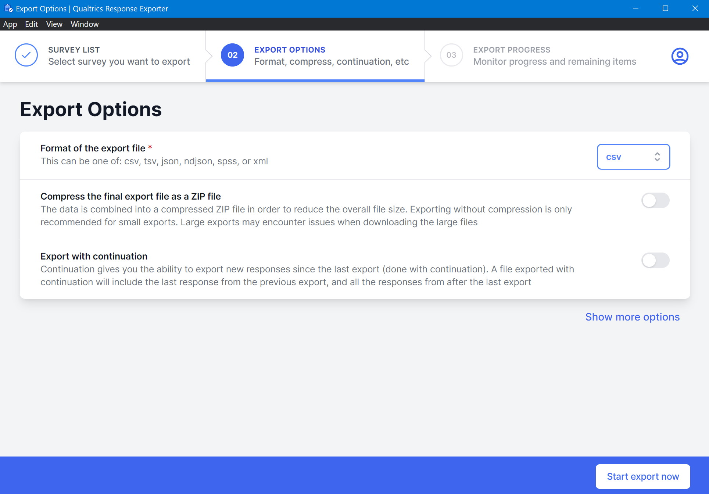
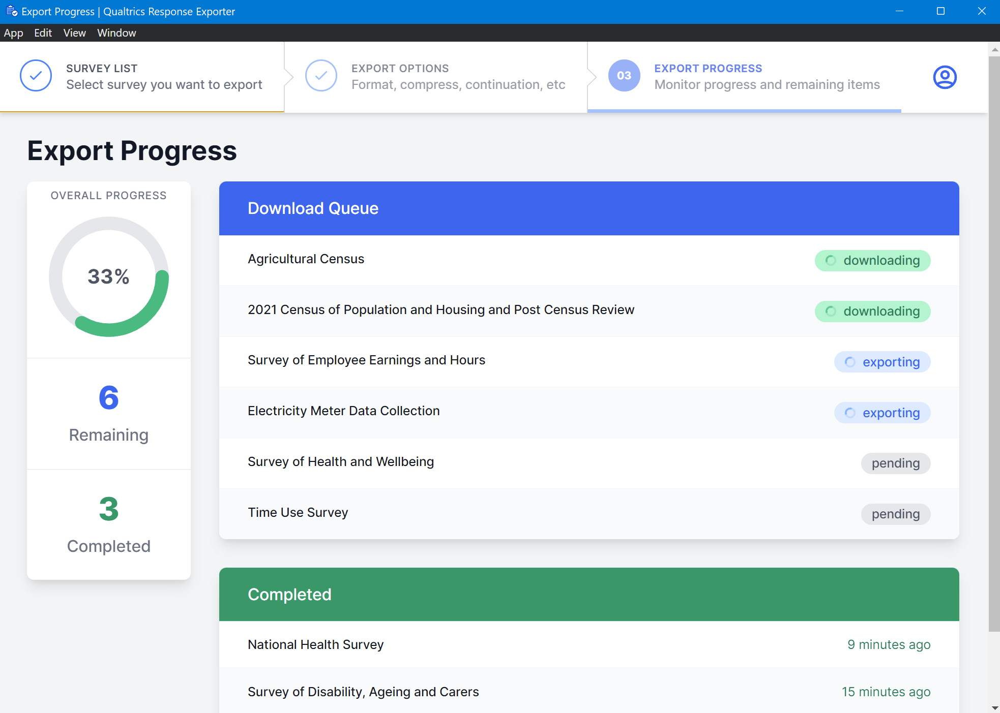
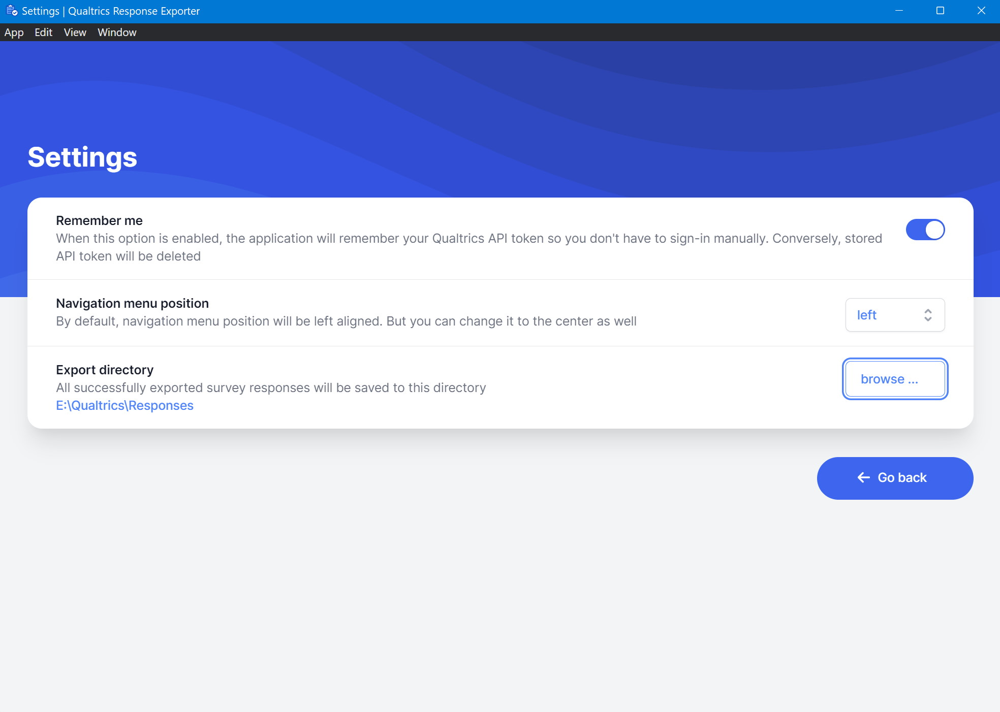

# Qualtrics Response Exporter UI
Web-based desktop application to export survey responses

## About The Project
If you have so many [Qualtrics](https://www.qualtrics.com) surveys and want to export its responses at once without having to click repeatedly on the web page, then this is the right tool for you

### Screenshots

### Built With
* [TypeScript](https://www.typescriptlang.org/)
* [Vue.js](https://v3.vuejs.org/)
* [Tailwind	CSS](https://tailwindcss.com/)
* [Electron.js](https://www.electronjs.org/)
* [Axios HTTP Client](https://axios-http.com/)
* [Limiter](https://github.com/jhurliman/node-rate-limiter)

## Usage
1. Download file Qualtrics-Response-Exporter.exe from [latest release](https://github.com/deddyss/qualtrics-response-exporter-ui/releases/latest)
2. Since this is a portable application, you don't need to install it first. Just run file Qualtrics-Response-Exporter.exe

## License
Distributed under the MIT License. See `LICENSE` for more information.

## Attributions
* Application icon made by <a href="https://www.flaticon.com/authors/stockes-design" title="Stockes Design">Stockes Design</a> from <a href="https://www.flaticon.com/" title="Flaticon">Flaticon.com</a>
* Photos on sign-in page are retrieved from <a href="https://unsplash.com/">Unsplash.com</a>
* I customized the background on settings page at [SVGBackgrounds.com](https://www.svgbackgrounds.com/)

## Acknowledgements
* [Electron builder](https://www.electron.build/)
* [Jest](https://jestjs.io/)
* [Denque](https://github.com/invertase/denque)
* [Async-lock](https://github.com/rogierschouten/async-lock)
* [Webpack](https://webpack.js.org/)
